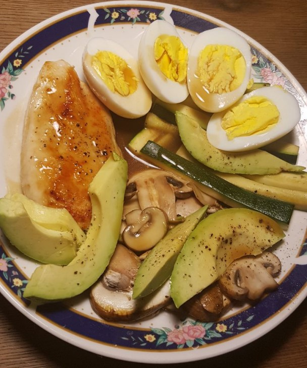

# Ramen Inspired Keto Bowl

<!--zutaten-->
|Menge|Zutat|Zubereitung|  |
|:----|----:|-----------|-:|
|2|Eier|kochen, pellen, halbieren|1.|
|1|Hähnchenbrust|braten|2.|
|125g|Pilze|als Scheiben anbraten|3.|
|1|Zuccini|als Sticks anbraten|4.|
|0.5|Avokado|in Streifen schneiden|5.|
|125g|Soße|über alles gießen|6.|
<!--/zutaten-->

